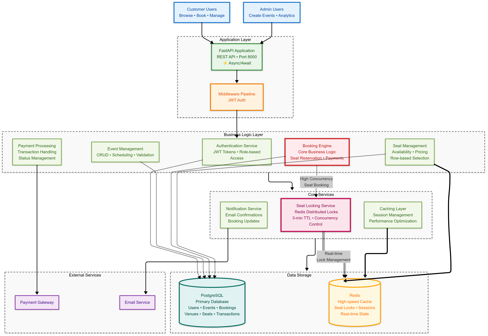
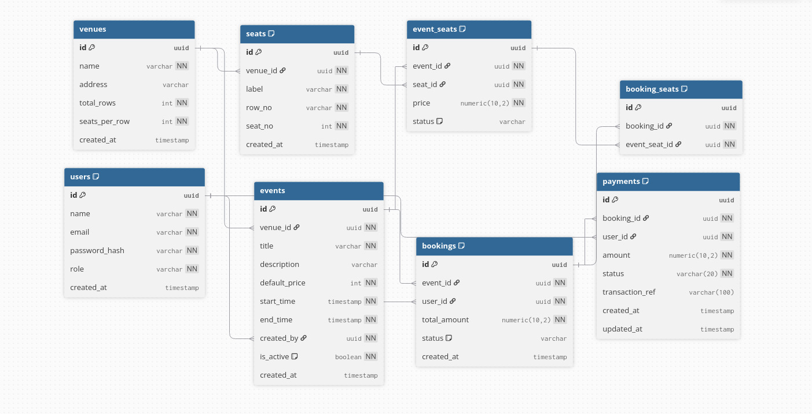
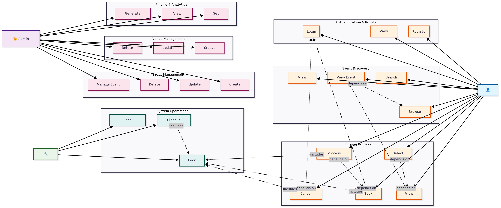

# Eventify

A FastAPI-based event booking system with PostgreSQL database, Redis caching, and comprehensive booking management features.

## 🚀 Features

- **Event Management**: Create, read, update, and delete events
- **Venue Management**: Manage venues and their details
- **Seat Management**: Handle seat allocation and availability
- **Booking System**: Complete booking flow with seat selection
- **Payment Integration**: Payment processing and management
- **Analytics**: Event and booking analytics
- **User Management**: User registration and authentication
- **Database Migrations**: Alembic for database schema management

---

## 🌐 Live Backend & Demo
- 🔗 **Backend API (Deployed on Render):** [eventify-backend-lj1g.onrender.com](https://eventify-backend-lj1g.onrender.com/)  
  👉 You can test routes and view API docs at `/docs`.

- 🎥 **Demo Video:** [Watch Here](https://drive.google.com/file/d/1Jzop--SmvikzlHhA5dcrd9rnoUc7wA7O/view?usp=sharing)


---

## 🏗️ System Architecture

<p align="center">
  
</p>

---

## 🗄️ Database Design

<p align="center">
  
</p>

---

## 🔄 Booking Workflow

<p align="center">
  
</p>

---


## 📁 Project Structure

```
BookMyEvent/
├── app/
│   ├── api/v1/           # API endpoints
│   │   ├── analytics.py
│   │   ├── bookings.py
│   │   ├── events.py
│   │   ├── event_seats.py
│   │   ├── payments.py
│   │   ├── users.py
│   │   └── venues.py
│   ├── core/             # Core configuration
│   │   ├── config.py
│   │   └── redis.py
│   ├── db/               # Database configuration
│   ├── middleware/       # Custom middleware
│   ├── models/           # SQLAlchemy models
│   ├── processor/        # Business logic processors
│   ├── schemas/          # Pydantic schemas
│   ├── service/          # Service layer
│   └── main.py           # FastAPI application entry point
├── alembic/              # Database migrations
├── requirements.txt      # Python dependencies
├── Dockerfile            # Development Docker configuration
├── Dockerfile.prod       # Production Docker configuration
├── docker-compose.yml    # Multi-service Docker setup
├── .env.example          # Environment variables template
└── start.sh             # Startup script
```

## 🛠️ Tech Stack

- **Framework**: FastAPI
- **Database**: PostgreSQL with AsyncPG
- **ORM**: SQLAlchemy (Async)
- **Migrations**: Alembic
- **Cache**: Redis
- **Authentication**: JWT
- **Containerization**: Docker & Docker Compose

## 🚀 Quick Start

### Prerequisites

- Docker and Docker Compose
- Python 3.12+ (for local development)

### Using Docker (Recommended)

1. **Clone the repository**
   ```bash
   git clone <repository-url>
   cd BookMyEvent
   ```

2. **Set up environment variables**
   ```bash
   cp .env.example .env
   # Edit .env with your preferred values
   ```

3. **Start the application**
   ```bash
   docker-compose up --build
   ```

4. **Access the application**
   - API: http://localhost:8000
   - Interactive API docs: http://localhost:8000/docs
   - Alternative API docs: http://localhost:8000/redoc

### Local Development

1. **Create virtual environment**
   ```bash
   python -m venv myenv
   source myenv/bin/activate  # On Windows: myenv\Scripts\activate
   ```

2. **Install dependencies**
   ```bash
   pip install -r requirements.txt
   ```

3. **Set up environment variables**
   ```bash
   cp .env.example .env
   # Edit .env with your database and Redis configuration
   ```

4. **Run database migrations**
   ```bash
   alembic upgrade head
   ```

5. **Start the application**
   ```bash
   uvicorn app.main:app --reload
   ```

## 🐳 Docker Commands

### Development

```bash
# Build and start all services
docker-compose up --build

# Start in background
docker-compose up -d

# View logs
docker-compose logs -f

# Stop all services
docker-compose down

# Stop and remove volumes
docker-compose down -v
```

### Production

```bash
# Build production image
docker build -f Dockerfile.prod -t bookmyevent-api .

# Run production container
docker run -p 8000:8000 --env-file .env bookmyevent-api
```

### Database Operations

```bash
# Run migrations
docker-compose exec app alembic upgrade head

# Create new migration
docker-compose exec app alembic revision --autogenerate -m "description"

# Access database shell
docker-compose exec postgres psql -U postgres -d bookmyevent
```

## 📚 API Documentation

### Interactive Documentation

Once the application is running, you can access:

- **Swagger UI**: http://localhost:8000/docs
- **ReDoc**: http://localhost:8000/redoc

### Comprehensive API Reference

For detailed API documentation with examples, request/response schemas, and complete endpoint descriptions, see:

**[📖 Complete API Documentation](./API_DOCUMENTATION.md)**

This comprehensive guide includes:
- **User APIs** - Authentication, event discovery, booking management
- **Admin APIs** - Event/venue management, analytics, seat pricing
- **Request/Response Examples** - JSON examples for all endpoints
- **Authentication Guide** - JWT token usage and role-based access
- **Error Handling** - Common error codes and troubleshooting

### Available Endpoints

- `/users` - User management
- `/venues` - Venue management
- `/events` - Event management
- `/event-seats` - Event seat management
- `/bookings` - Booking management
- `/payments` - Payment processing
- `/analytics` - Analytics and reporting

## 🔧 Configuration

### Environment Variables

| Variable | Description | Default |
|----------|-------------|---------|
| `POSTGRES_USER` | Database username | postgres |
| `POSTGRES_PASSWORD` | Database password | - |
| `POSTGRES_DB` | Database name | bookmyevent |
| `POSTGRES_SERVER` | Database host | localhost |
| `POSTGRES_PORT` | Database port | 5432 |
| `REDIS_URL` | Redis connection URL | redis://localhost:6379/0 |
| `PROJECT_NAME` | Application name | BookMyEvent API |

## 🗄️ Database

The application uses PostgreSQL with Alembic for migrations. All database schemas are defined in the `app/models/` directory and managed through Alembic migrations in the `alembic/` directory.

### Migration Commands

```bash
# Create a new migration
alembic revision --autogenerate -m "description"

# Apply migrations
alembic upgrade head

# Rollback migration
alembic downgrade -1
```
